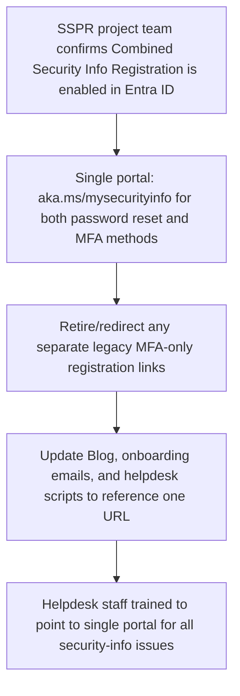
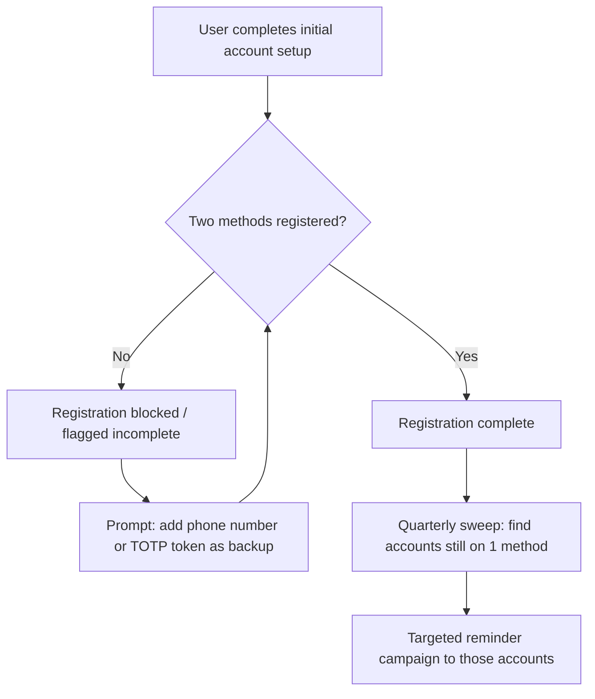
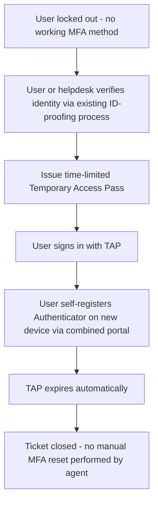
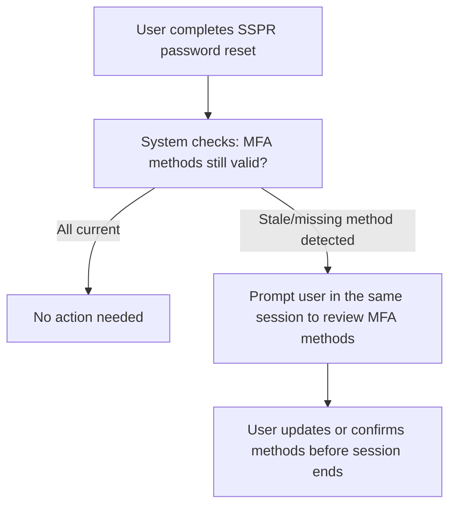
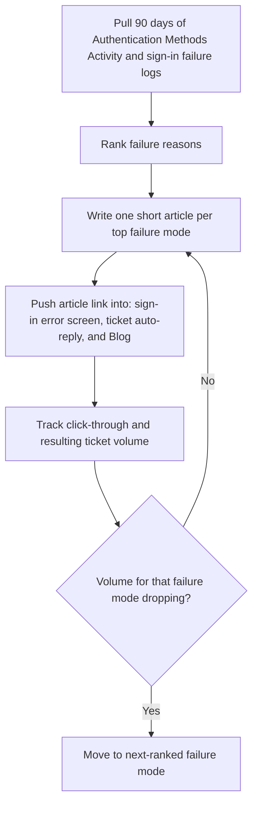
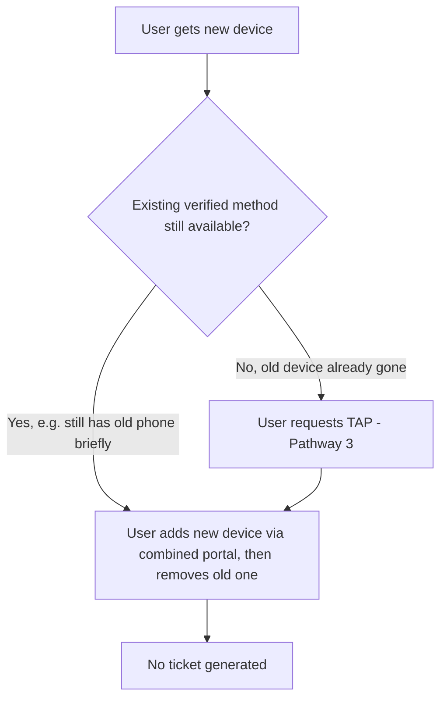
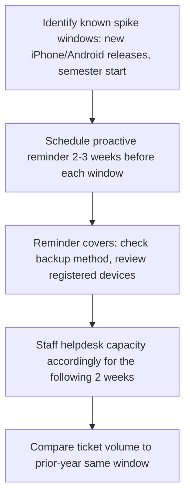
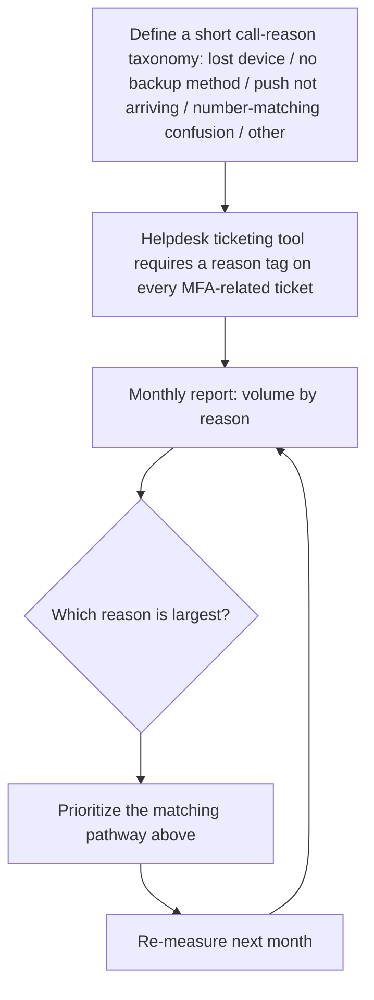

# Reducing MFA/Microsoft Authenticator Support Calls

Context: SSPR (self-service password reset) project currently in flight. Entra ID treats password-reset methods and MFA methods as the same underlying "security info" registration, so this work can piggyback directly on the SSPR project rather than run as a separate initiative. Each pathway below follows the same format as Part 4: the problem it solves, a flowchart, and concrete steps with an owner and a way to measure whether it worked.

## Pathway 1: Consolidate SSPR and MFA registration into one flow

**Problem it solves:** Users bouncing between separate password-reset and MFA-registration experiences, generating "which link do I use" calls.

**Steps**

1. SSPR project team verifies Combined Registration is turned on tenant-wide (not just for pilot users).
2. Every user-facing communication - onboarding email, Blog article, tickets - references the one portal URL.
3. Helpdesk call scripts and knowledge-base articles are updated so agents stop distinguishing "password issue" from "MFA issue" as separate intake paths.
4. **Owner:** SSPR project team + Communications. **Success metric:** drop in tickets tagged with "wrong portal" or "couldn't find MFA settings."

## Pathway 2: Require a backup authentication method at registration

**Problem it solves:** The single biggest driver of lockout calls - a user with only Authenticator push registered and no second method when they get a new phone.

**Steps**

1. Set an Entra ID Authentication Methods policy requiring registration of two methods before setup is considered complete (e.g., Authenticator + phone, or Authenticator + hardware token).
2. Build this requirement into new-employee and new-student onboarding, not just as a policy buried in documentation.
3. Run a quarterly report identifying accounts still on a single method (a natural extension of the SSPR project's existing registration reporting) and send a targeted, short reminder - not a mass email.
4. **Owner:** Identity team. **Success metric:** % of accounts with 2+ methods registered, tracked monthly.

## Pathway 3: Temporary Access Pass (TAP) instead of manual MFA resets

**Problem it solves:** Long, manual identity-verification calls when someone is fully locked out (lost phone, wiped device).

**Steps**

1. Enable Temporary Access Pass in the Entra ID Authentication Methods policy (works alongside the SSPR project's existing identity-verification flow).
2. Define a short, consistent ID-proofing script for helpdesk agents to follow before issuing a TAP (this replaces, rather than adds to, today's manual reset process).
3. Point users to the combined portal to finish re-registration themselves once they have the TAP - the agent's job ends at issuing the pass.
4. **Owner:** Helpdesk Manager + Identity team. **Success metric:** average handle time for lockout tickets, before vs. after.

## Pathway 4: MFA health check after every password reset

**Problem it solves:** Users who just went through SSPR because they forgot their password often also have a stale phone number or a deleted Authenticator entry, generating a second call weeks later.

**Steps**

1. Add a post-reset step to the SSPR flow that checks whether the account's registered MFA methods look stale (e.g., a phone number that bounced recently, or only one method on file).
2. If something looks off, prompt the user to review it in the same session - while they're already authenticated and engaged - rather than waiting for it to surface as a future lockout.
3. **Owner:** SSPR project team. **Success metric:** rate of repeat tickets from the same user within 30 days of a password reset.

## Pathway 5: Deflection content for the top failure modes

**Problem it solves:** Avoidable calls for push-notification delivery issues, number-matching confusion, and multiple-account mix-ups - all fixable with a 60-second self-check.

**Steps**

1. Pull real failure-reason data rather than guessing - Entra ID's sign-in logs and Authentication Methods Activity report break this down directly.
2. Write one short, visual (screenshot-based) article per top cause - likely push-not-arriving (battery optimization/notification settings), number-matching confusion, and multiple-account mix-ups.
3. Surface the relevant article automatically at the point of failure (e.g., linked from the sign-in error message itself) rather than only in a knowledge base people have to go find.
4. **Owner:** Communications + Identity. **Success metric:** ticket volume per failure-mode category, tracked over time (requires Pathway 8's taxonomy).

## Pathway 6: Self-service device re-registration

**Problem it solves:** The routine "I got a new phone" case still requiring a live agent.

**Steps**

1. Make sure the combined portal (Pathway 1) makes "add a new device" and "remove an old device" obviously self-serviceable without contacting the helpdesk.
2. Cross-link this capability from the same onboarding and Blog content used in Pathways 1 and 2, so people know the option exists before they need it.
3. **Owner:** SSPR project team. **Success metric:** ratio of self-service re-registrations to helpdesk-assisted ones.

## Pathway 7: Proactive campaigns timed to known spikes

**Problem it solves:** Predictable seasonal spikes (new-phone season, start of semester) catching the helpdesk off guard every year.

**Steps**

1. Mark known spike windows on the communications calendar (major device-OS release dates, start of fall/spring semester for new accounts).
2. Send a short, proactive reminder ahead of each window rather than only reacting once volume rises.
3. Temporarily adjust helpdesk staffing for the following two weeks based on prior-year patterns.
4. **Owner:** Communications + Helpdesk workforce planning. **Success metric:** year-over-year ticket volume during each known window.

## Pathway 8: Call-reason measurement loop

**Problem it solves:** Without this, it's impossible to tell which of the above pathways is actually moving the number - this pathway ties all the others together.

**Steps**

1. Define a short, mutually exclusive set of order groups (5-6 max, so agents actually use it consistently).
2. Require a reason tag before a ticket can be closed - this is a small ticketing-tool configuration change, not a new system.
3. Review the breakdown monthly and route effort to whichever pathway addresses the current largest category, rather than working all of them at once.
4. **Owner:** Helpdesk Manager. **Success metric:** this pathway *is* the measurement system for every other pathway's success metric above.
